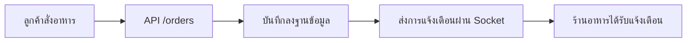

# 🚀 ระบบการแจ้งเตือนแบบเรียลไทม์ด้วย WebSocket

ระบบนี้ได้รับการพัฒนาขึ้นเพื่อแจ้งเตือนร้านอาหารทันทีเมื่อมีลูกค้าสั่งอาหาร โดยใช้เทคโนโลยี **Socket.IO** สำหรับการสื่อสารแบบเรียลไทม์

## ✨ ฟีเจอร์หลัก

### 🔔 การแจ้งเตือนเรียลไทม์
- แจ้งเตือนร้านอาหารทันทีเมื่อมีออเดอร์ใหม่
- แจ้งเตือนลูกค้าเมื่อสถานะออเดอร์เปลี่ยนแปลง
- เสียงแจ้งเตือนและการนับจำนวนออเดอร์ใหม่

### 🏠 Room Management
- **Restaurant Room**: สำหรับร้านอาหารรับการแจ้งเตือนออเดอร์ใหม่
- **Customer Room**: สำหรับลูกค้ารับการอัพเดทสถานะ
- **Rider Room**: สำหรับไรเดอร์รับการแจ้งเตือนการจัดส่ง

## 📁 ไฟล์ที่สำคัญ

### Backend (Server)
```
pages/api/socket.ts                 # Socket.IO Server
src/lib/socket.ts                   # Socket Utilities
src/app/api/orders/route.ts         # API สร้างออเดอร์
src/app/api/orders/[id]/route.ts    # API อัพเดทสถานะ
```

### Frontend (Client)
```
src/hooks/useSocket.ts                    # React Hook สำหรับ Socket.IO
src/app/cart/client.tsx                   # หน้าตะกร้า + สั่งอาหาร
src/app/restaurant/dashboard/client.tsx   # Dashboard ร้านอาหาร
src/app/test-websocket/page.tsx          # หน้าทดสอบระบบ
```

### Documentation
```
docs/WEBSOCKET_NOTIFICATION_SYSTEM.md    # เอกสารระบบแจ้งเตือน
README_WEBSOCKET.md                      # ไฟล์นี้
```

## 🛠️ การติดตั้งและใช้งาน

### 1. ติดตั้ง Dependencies
```bash
npm install socket.io socket.io-client
```

### 2. เริ่มต้นระบบ
เริ่มต้น Next.js server ปกติ Socket.IO จะเริ่มต้นอัตโนมัติ:
```bash
npm run dev
```

### 3. ทดสอบระบบ
1. เปิด **Restaurant Dashboard**: `http://localhost:3000/restaurant/dashboard`
2. เปิดแท็บใหม่ไปที่ **Cart**: `http://localhost:3000/cart`
3. เพิ่มสินค้าและสั่งอาหาร
4. ดูการแจ้งเตือนใน Dashboard

### 4. หน้าทดสอบ
สำหรับการทดสอบระบบโดยตรง: `http://localhost:3000/test-websocket`

## 🔄 Flow การทำงาน

### การสั่งอาหาร


### การอัพเดทสถานะ
```mermaid
graph LR
    A[ร้านอัพเดทสถานะ] --> B[API /orders/[id]]
    B --> C[อัพเดทฐานข้อมูล]
    C --> D[ส่งการแจ้งเตือนผ่าน Socket]
    D --> E[ลูกค้าได้รับอัพเดท]
```

## 📡 API Endpoints

### POST /api/orders
สร้างออเดอร์ใหม่และส่งการแจ้งเตือน
```json
{
  "customerInfo": {
    "name": "ชื่อลูกค้า",
    "phone": "เบอร์โทร",
    "address": "ที่อยู่"
  },
  "restaurantId": "restaurant-1",
  "items": [...],
  "totalAmount": 180
}
```

### PATCH /api/orders/[id]
อัพเดทสถานะออเดอร์
```json
{
  "status": "CONFIRMED"
}
```

### GET /api/orders
ดึงรายการออเดอร์ (สามารถกรองด้วย restaurantId และ status)

## 🎯 Socket Events

### new-order
ส่งไปยังร้านอาหารเมื่อมีออเดอร์ใหม่
```typescript
{
  orderId: string,
  orderNumber: string,
  customerName: string,
  customerPhone: string,
  totalAmount: number,
  items: OrderItem[],
  // ...
}
```

### order-update
ส่งไปยังลูกค้าเมื่อสถานะเปลี่ยน
```typescript
{
  orderId: string,
  orderNumber: string,
  status: string,
  message: string,
  // ...
}
```

## 🎨 UI Components

### Restaurant Dashboard
- แสดงรายการออเดอร์แบบเรียลไทม์
- นับจำนวนออเดอร์ใหม่
- เสียงแจ้งเตือน
- อัพเดทสถานะออเดอร์

### Cart Page
- กรอกข้อมูลลูกค้า
- ส่งออเดอร์ไปยัง API
- แสดงการแจ้งเตือนเมื่อสำเร็จ

## 🔧 การปรับแต่ง

### เปลี่ยนเสียงแจ้งเตือน
แก้ไขฟังก์ชัน `playNotificationSound()` ใน `RestaurantDashboardClient`

### เพิ่ม Push Notifications
```javascript
if ('Notification' in window && Notification.permission === 'granted') {
  new Notification('ออเดอร์ใหม่!', {
    body: 'มีออเดอร์ใหม่เข้ามา',
    icon: '/icon.png'
  });
}
```

### เพิ่มการแจ้งเตือนสำหรับไรเดอร์
ใช้ `notifyRider()` function ใน socket utils

## 🐛 การแก้ไขปัญหา

### ไม่ได้รับการแจ้งเตือน
1. ตรวจสอบสถานะการเชื่อมต่อ Socket
2. ตรวจสอบว่าเข้าร่วม room ถูกต้อง
3. ดู Console สำหรับข้อผิดพลาด

### การเชื่อมต่อขาดหาย
- Socket.IO จะ reconnect อัตโนมัติ
- ตรวจสอบ network connection

## 📈 การพัฒนาต่อ

### ฟีเจอร์ที่สามารถเพิ่มได้
- [ ] การแจ้งเตือนผ่าน LINE Notify
- [ ] เก็บประวัติการแจ้งเตือนในฐานข้อมูล
- [ ] การตั้งค่าเสียงแจ้งเตือนตามประเภท
- [ ] Dashboard แสดงสถิติการแจ้งเตือน
- [ ] การส่งอีเมลแจ้งเตือน backup

## 🎉 สรุป

ระบบการแจ้งเตือนผ่าน WebSocket นี้ช่วยให้:
- ✅ ร้านอาหารรับทราบออเดอร์ทันที
- ✅ ลูกค้าติดตามสถานะได้แบบเรียลไทม์
- ✅ ลดเวลาในการตอบสนอง
- ✅ เพิ่มประสิทธิภาพการบริการ

พัฒนาโดยใช้ **Socket.IO**, **Next.js API Routes**, และ **React Hooks** 🚀 